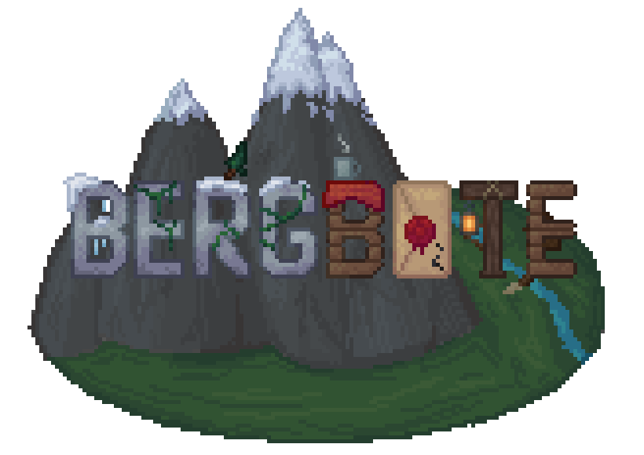

# Der Bergbote



## Beschreibung

Es soll eine Nachrichten-App entwickelt werden, die die Standpunkte zu verschiedenen Themen von verschiedenen Nachrichtendiensten sammelt und gegenüberstellt.
Nutzer können durch Gameification die Standpunkte der Nachrichtendienste bewerten.
Der Nutzen des Projekts ist die unparteiische Information zu wichtigen Themen des Alltags aus verschiedenen Perspektiven, wobei angegeben wird, welcher Bias (Vorurteil) bei den Quellen herrscht.
Zur Sammlung der Artikel sollen bestehende deutschsprachige Medien verwendet werden. (Die Presse, Der Standard, Heute.at, Bild.de, etc.)
Um die Artikel nach Themengebieten (z.B.: Koalitionsverhandlungen, KTM Insolvenz, etc.) zu gruppieren, ist der Einsatz von KI geplant, der Ausmaß und die Art dessen jedoch noch nicht bekannt.

## Team

-   Tobias Kendlbacher [kendlbat.dev](https://kendlbat.dev)
-   Noah Arsic [GitHub - @Noahgamerrr](https://github.com/Noahgamerrr)
-   Matthias
-   Alexander

## Technologien

-   [React](https://react.dev/)
-   [Astro](https://astro.build/)
-   [PostgreSQL](https://www.postgresql.org/)
-   [drizzle ORM](https://orm.drizzle.team/)

## Entwicklung

### Prerequisites

Docker
Node.js
npm

### Setup

Provide a `.env` file with the following content:

```bash
AUTH_SECRET=<RANDOM_STRING>
ARTICLES_SERVICE_TOKEN=<RANDOM_STRING>
ENTRA_CLIENT_ID=<CLIENT_ID>
ENTRA_CLIENT_SECRET=<CLIENT_SECRET>
ENTRA_ISSUER=https://login.microsoftonline.com/<TENANT_ID>/v2.0
```

`AUTH_SECRET` must be at least 32 characters long.
`ENTRA_`-values can be generated from an Azure App registration.

### Database Development

To start the database:

```bash
docker compose up postgres -d
```

To initialize the schema:

```bash
npx drizzle-kit push
```
